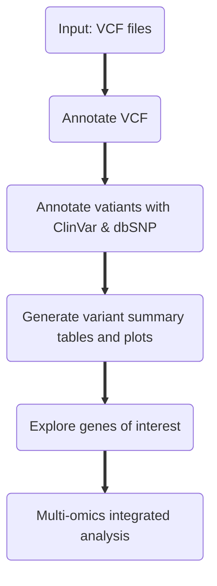

# WES

Whole exon sequencing (WES) is a widely used NGS method to scan exonic variants. Due to the high cost of whole genome sequencing (WGS), WES is commonly uses as a cost-effective alternative for studies focusing on exon regions. 

## WES Experimental Design Best Practice
- **Study Deisgn**:
  * Highly recommend to have tumor / normal paired samples for somatic variant detection.
- **Target Sequencing Depth**:
  * Somatic variant calling: >=100X
  * Germline variant calling: >=50X
- **Platform**:
    * Illumina NovaSeq 6000

## WES Caveats
- WES lacks the ability to capture the entire non-coding genome and sometimes part of the coding regions.
- WES cannot replace WGS in identifying genome structural variants, such as copy number variants (CNVs).
- Different WES variant calling algorithms have their own advantages and weaknesses. The choice of the analysis method should be exmained and tested for specific samples and projects.

## Germline Short Variant Discovery (SNPs and Indels)
- Germline short variant detection identifies SNPs and indels using DeepVariant:
  * By default, a “PASS” filter is applied which essentially means that the variant in question has passed certain quality filters set by the variant caller.

## Somatic Short Variant Discovery (SNPs and Indels)
- Somatic short variant detection identifies SNVs and indels using Strelka2.
- The resulting VCFs are annotated utilizing SnpEff and SnpSift. `02_annotate_VCF_GO.R` can be used for annotation.
- Strelka2 does have calculate variant allele frequency (VAF) automatically. `03_calculate_VAF.R` can be used if interested in exploring VAF for variants (VCF as input).

## Post-processing VCF and Variant Annotation



## WES Computational Analysis
- `01_nextflow_WES.sh` General command lines used to process raw reads using nf-core pipelines.
   * example_wes_config.csv:
  ```
  patient,sample,fastq_1,fastq_2
  lineA,evolved,lineA_R_S1_L002_R1_001.fastq.gz,lineA_R_S1_L002_R2_001.fastq.gz
  ```
  Germline calling
  ```
  nextflow run nf-core/sarek --input sample_wes_germline_config.csv --outdir output_germline \
  --wes --tools deepvariant --genome GATK.GRCh38 -profile docker -r 3.1.2 \
  --trim_fastq --detect_adapter_for_pe
  ```
  Somatic calling
  ```
  nextflow run nf-core/sarek --input sample_wes_somatic_config.csv --outdir output_somatic \
  --wes --tools strelka --genome GATK.GRCh38 -profile docker -r 3.1.2 \
  --trim_fastq --detect_adapter_for_pe
  ```
  > Note If you are new to Nextflow and nf-core, please refer to [this page](https://nf-co.re/docs/usage/installation) on how to set-up Nextflow. Make sure to [test your setup](https://nf-co.re/docs/usage/introduction#how-to-run-a-pipeline) with -profile test before running the workflow on actual data.


## Tools
- R 3.1.2
- Sarek 3.2.2
- FastQC 0.11.9
- MultiQC 1.13
- FastP 0.23.2
- BBduck 38.96
- BWA-MEM2 0.7.17-r1188
- MarkDuplicates 4.3.0.0
- BaseRecalibrator 4.3.0.0
- ApplyBQSR 1.4.0
- Deepvariant 1.4.0
- Strelka2 2.9.10
- SnpEFF & SnpSift 5.1
  
